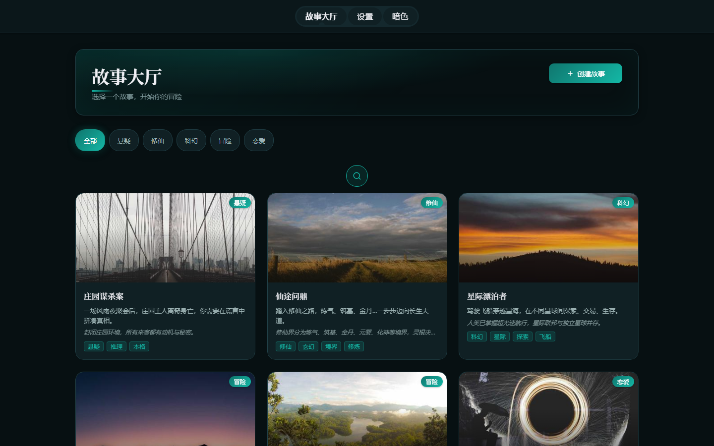
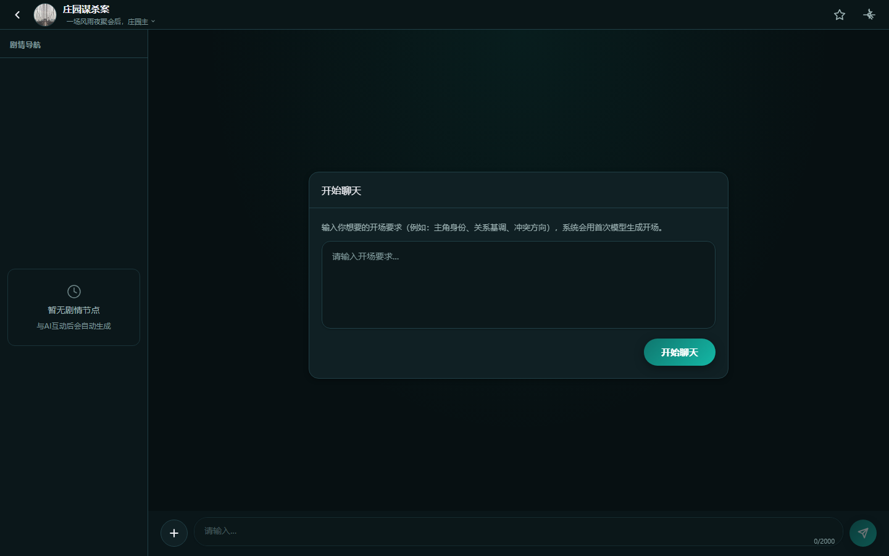

<div align="center">

# 📖 WHnovel

**聊着聊着，剧情就推进了。选一个故事，跟 AI 聊下去，故事自然往前走。**

自托管的 AI 互动小说平台——一个故事大厅、一个聊天窗口、一个记得住三章之前发生了什么事的 AI。

[](https://github.com/wh520-wh/WHnovel/actions/workflows/ci.yml)
[](LICENSE)
[]()
[]()
[]()

[English](README.md) · [中文](README.zh.md)

</div>

---

## 为什么是 WHnovel？

市面上的 AI 角色扮演工具，要么是**没有故事层的折腾型前端**（SillyTavern 这类）、
要么是**没有叙事结构的封闭聊天 App**（Character.AI 这类）、要么是**锁在云端的订阅制冒险游戏**
（AI Dungeon 这类）。WHnovel 是把**故事本身**当产品做的那个：

- 🕰️ **剧情时间线**——剧情标签变成一条可点击的时间线，随时跳回故事的任何一个节拍
- 🧩 **结构化剧情输出**——AI 先写正文，再异步回写结构化尾部（剧情状态、标签、高亮词），
  让故事在几百轮对话后依然前后连贯
- 🔑 **自己的模型、自己的数据**——随便接一个 OpenAI 兼容 API Key（聊天和图片模型都有），
  一切跑在自己的机器上，不锁云端

## ✨ 功能

**故事优先**——竞品没有的那部分：

- **两段式输出**：正文先流式出来，再异步回写结构化尾部（剧情状态、标签、高亮词）——AI 再快，正文始终干净可读
- **剧情时间线**：点任何标签跳到剧情对应段落，整个故事脉络始终可回溯
- **AI 插图**：封面和聊天插图共用一个可配置的图片模型
- **存档系统**：创建、导出 JSON、导入、行内重命名——故事随身走

**聊天体验顺滑**：

- **SSE 流式输出**，带打字指示器和智能滚动（跟着剧情走，不拽页面）
- **剧情状态随提示词注入**，AI 记得住前面的章节

**完全归你**：

- 自托管：FastAPI + SQLite，零外部依赖
- 管理面板：配聊天/图片模型、改提示词、管存档选项
- 移动端友好：虚拟键盘偏移、44px 最小触控区、刘海屏安全区

## 🛡️ 隐私与安全

- **无遥测、无跟踪**——什么都不往外传，除了你配置的模型 API，应用不会联系任何外部服务器
- **数据全在本地**——故事、存档、设置都存在本地 SQLite 数据库里
- **API Key 只归你**——密钥只存本地，只发给你选择的模型服务商
- **一切尽在掌控**——应用能做的动作（启动、停止、删除）都是明确操作，没有后台清理逻辑

## 📸 截图

**故事大厅**——按分类浏览、选一个故事，开始你的冒险：



**聊天与时间线**——剧情标签出现的同时，左侧剧情导航同步生成，每个节点都可点击：



## ⚡ 快速开始

需要 Node.js 18+、Python 3.10+。

```bash
git clone https://github.com/wh520-wh/WHnovel.git
cd WHnovel
```

后端：

```bash
cd backend
pip install -r requirements.txt
python run.py
```

前端（另开一个终端）：

```bash
cd frontend
npm install
npm run dev
```

Windows 用户也可以直接跑 `start.ps1` 或 `start.bat`（`stop.bat` 停服务）。

默认地址：前端 `http://localhost:5173`，后端 `http://localhost:8000`。

> 管理面板：浏览器控制台输入 `localStorage.admin_mode = '1'` 后刷新。

## 🧰 技术栈

| 层 | 技术 |
| --- | --- |
| 前端 | Vue 3 · Vite · TypeScript · Pinia · Element Plus |
| 后端 | FastAPI · SQLAlchemy · SQLite |
| 模型 | 任意 OpenAI 兼容 API（聊天 + 图片）· SSE 流式 |

## 🧭 产品方向

定位与路线图基于一份竞品调研报告：
[docs/research/2026-07-31-competitive-research.md](docs/research/2026-07-31-competitive-research.md)。

重点方向：剧情状态库（世界线/人物线/感情线）、兼容 SillyTavern 生态的角色卡导入（v2/v3）、
时间线任意节点分支重开、长对话自动摘要。

## 🛠 开发

后端——Ruff + pytest：

```bash
cd backend
pip install -r requirements-dev.txt
ruff check .          # lint
ruff format .         # 格式化
pytest                # 测试
```

前端——ESLint + Prettier + vitest：

```bash
cd frontend
npm ci
npm run lint          # ESLint
npm run format        # Prettier
npm run type-check    # TypeScript 类型检查
npm run test          # 测试
```

提 PR 时 CI 自动跑这些检查。

## 📁 目录结构

```
WHnovel/
├── backend/             FastAPI 服务
│   ├── app/             路由、模型、聊天流水线、加密
│   ├── tests/           pytest 测试
│   └── run.py           启动入口
├── frontend/            Vue 3 SPA
│   ├── src/
│   │   ├── stores/      Pinia 状态管理
│   │   ├── composables/ 流式聊天、滚动、图片等
│   │   ├── views/       页面
│   │   └── api/         HTTP 和 SSE 封装
│   └── package.json
├── .github/workflows/   CI 配置
├── CONTRIBUTING.md
├── LICENSE
└── README.md
```

## 🤝 贡献

看 [CONTRIBUTING.md](CONTRIBUTING.md)。Issue 反馈问题，PR 提到 `main`，改后端逻辑记得带测试。

## 📄 许可

MIT — 详见 [LICENSE](LICENSE)。
